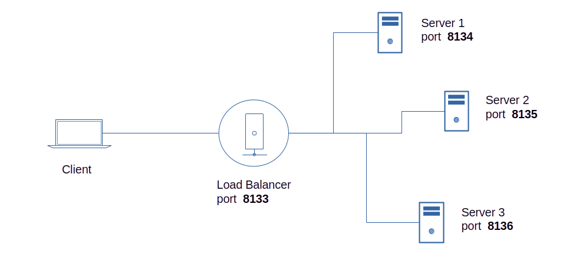

## Edge Load Balancer


<br>

#### Create a project directory for each edge endpoint and install *m2m*.
```js
$ npm install m2m
```
### Server 1
#### Save the code below as *app.js* in your server1 project directory.

```js
const m2m = require('m2m')

let edge = new m2m.Edge({name:'server1'})

// simulated data source
function dataSource(){
  return 20 + Math.floor(Math.random() * 10)
}

m2m.connect(() => {

  let port = 8144

  edge.createServer(port, (server) => {

    server.on('error', (error) => { 
      console.log('error:', error)
    })

    server.dataSource('test-data', (tcp) => {
      tcp.send({server:1, topic:tcp.topic, value:dataSource()})         
    })
  })
})
```
### Server 2
#### Save the code below as *app.js* in your server2 project directory.

```js
const m2m = require('m2m')

let edge = new m2m.Edge({name:'server2'})

// simulated data source
function dataSource(){
  return 20 + Math.floor(Math.random() * 10)
}

m2m.connect(() => {

  let port = 8145

  edge.createServer(port, (server) => {

    server.on('error', (error) => { 
      console.log('error:', error)
    })

    server.dataSource('test-data', (tcp) => {
      tcp.send({server:2, topic:tcp.topic, value:dataSource()})             
    })
  })
})
```
### Server 3

#### Save the code below as *app.js* in your server3 project directory.
```js
const m2m = require('m2m')

let edge = new m2m.Edge({name:'server3'})

// simulated data source
function dataSource(){
  return 20 + Math.floor(Math.random() * 10)
}

m2m.connect(() => {

  let port = 8146

  edge.createServer(port, (server) => {

    server.on('error', (error) => { 
      console.log('error:', error)
    })

    server.dataSource('test-data', (tcp) => {
      tcp.send({server:3, topic:tcp.topic, value:dataSource()})       
    })
  })
})
```
### Load Balancer

#### Save the code below as *app.js* in your load balancer project directory.
```js
const m2m = require('m2m')

let edge = new m2m.Edge({name:'Load Balancer'})

m2m.connect(() => {

  let ec1 = new edge.client(8144)
  let ec2 = new edge.client(8145)
  let ec3 = new edge.client(8146)

  let port = 8143, data = null, load = 1  

  edge.createServer(port, (server) => {

    server.on('connection', (count) => { 
      console.log('connected client', count)
    })

    server.dataSource('test-data', async (tcp) => {
      if(load === 1){
        data = await ec1.read(tcp.topic)
        load = 2
      }
      else if(load === 2){
        data = await ec2.read(tcp.topic)
        load = 3
      }
      else if(load === 3){
        data = await ec3.read(tcp.topic)
        load = 1
      }
      tcp.send(data)
      console.log(data)
    })
  })
})
```
### Client

#### Save the code below as *app.js* in your client project directory.
```js
const m2m = require('m2m')

let edge = new m2m.Edge({name:'client'})

async function main (){

  await m2m.connect();

  let ec = new edge.client(8143)

  ec.on('ready', (result) => { 
    console.log('ready:', result)
  })

  ec.on('error', (error) => { 
    console.log('error:', error)
  })

  setInterval(async () => {

    // async/await api
    let data = await  ec.read('test-data')
    console.log(data)

    /*
    // using callback api
    ec.read('test-data', (data) => {
      console.log(data)
    })
		
    // using promise api
    ec.read('test-data')
    .catch(console.log)
    .then(console.log)
    */
		
  }, 6000)
}
```

<br>

#### Start the application on each endpoint.
```js
$ node app.js
```

<br>

You should get a client output similar to the result as shown below.
```js
{ server: 1, topic: 'test-data', value: 27 }
{ server: 2, topic: 'test-data', value: 25 }
{ server: 3, topic: 'test-data', value: 22 }
...


```


