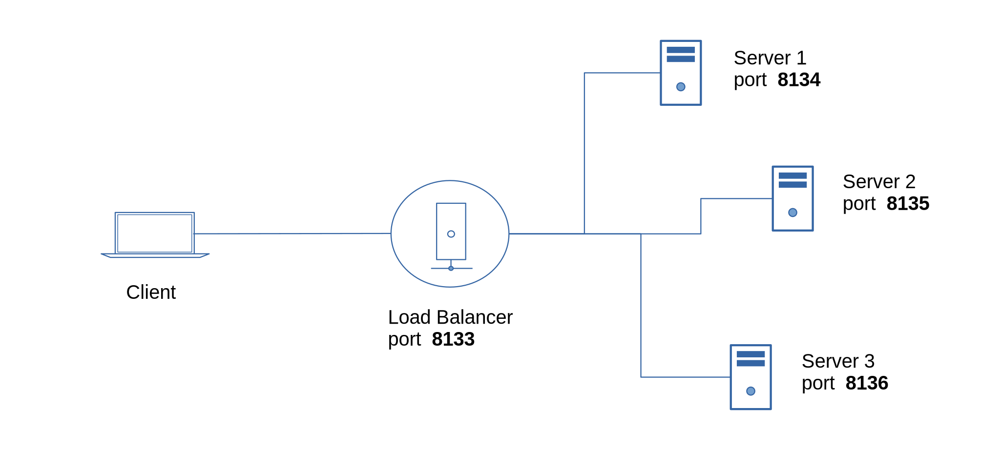

## Edge Load Balancing


<br>

#### Create a project directory for each edge endpoint and install *m2m*.

<br>

### Server 1

```js
$ npm install m2m
```

```js
const m2m = require('m2m')

// simulated data source
function dataSource(){
  return 20 + Math.floor(Math.random() * 10)
}

/***
 * tcp edge server 1
 */
    
let port = 8134

m2m.edge.createServer(port, (server) => {
    console.log('tcp server:', port)

    server.dataSource('test-data', (tcp) => {
        tcp.send({server:1, topic:tcp.topic, value:dataSource()})         
    })

    server.on('error', (err) => { 
        console.log('error:', err.message)
    })
})

```

### Server 2
```js
const m2m = require('m2m')

// simulated data source
function dataSource(){
  return 20 + Math.floor(Math.random() * 10)
}

/***
 * tcp edge server 2
 */
    
let port = 8135

m2m.edge.createServer(port, (server) => {
    console.log('tcp server:', port)

    server.dataSource('test-data', (tcp) => {
        tcp.send({server:2, topic:tcp.topic, value:dataSource()})             
    })

    server.on('error', (err) => { 
        console.log('error:', err.message)
    })
})

```

### Server 3
```js
const m2m = require('m2m')

// simulated data source
function dataSource(){
  return 20 + Math.floor(Math.random() * 10)
}

/***
 * tcp edge server 3
 */
    
let port = 8136

m2m.edge.createServer(port, (server) => {
    console.log('tcp server:', port)

    server.dataSource('test-data', (tcp) => {
        tcp.send({server:3, topic:tcp.topic, value:dataSource()})       
    })

    server.on('error', (err) => { 
        console.log('error:', err.message)
    })
})

```

### Load Balancer
```js
const m2m = require('m2m')

/***
 * tcp edge clients
 */

let ec1 = new m2m.edge.client(8134)
let ec2 = new m2m.edge.client(8135)
let ec3 = new m2m.edge.client(8136)


/***
 * tcp edge loadbalancer
 */
    
let port = 8133

let load = 1 

m2m.edge.createServer(port, (server) => {
    console.log('tcp edge loadbalancer:', port)

    server.dataSource('test-data', (tcp) => { 
        if(load === 1){
          load = 2;
          ec1.read(tcp.topic, (data) => {
            tcp.send(data)  
          })   
        }
        else if(load === 2){
          load = 3;
          ec2.read(tcp.topic, (data) => {
            tcp.send(data)  
          })   
        }
        else if(load === 3){
          load = 1;
          ec3.read(tcp.topic, (data) => {
            tcp.send(data)  
          })  
        }
    })

    server.on('connection', (count) => { 
        console.log('connected client', count)
    })
})

```

### Client
```js
const m2m = require('m2m')

/***
 * tcp edge client 1
 */

let ec1 = new m2m.edge.client(8133)

setInterval(() => {
    ec1.read('test-data', (data) => {
        console.log('test-data', data)
    })
}, 6000)

ec1.on('error', (err) => { 
    console.log('error:', err.message)
})

```

<br>

#### Start the application on each endpoint.

<br>

You should get a client output similar to the result as shown below.
```js
test-data { server: 1, topic: 'test-data', value: 27 }
test-data { server: 2, topic: 'test-data', value: 25 }
test-data { server: 3, topic: 'test-data', value: 22 }


```


